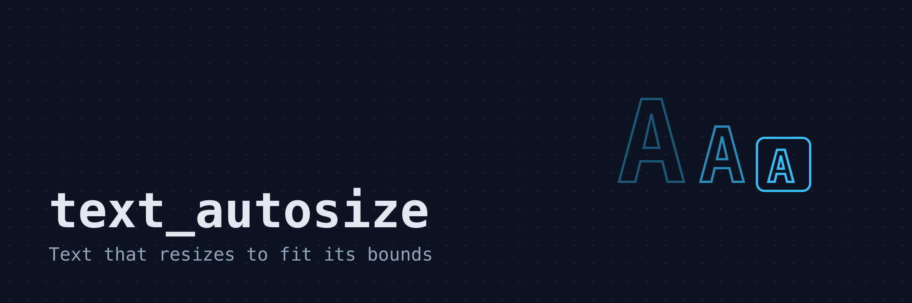
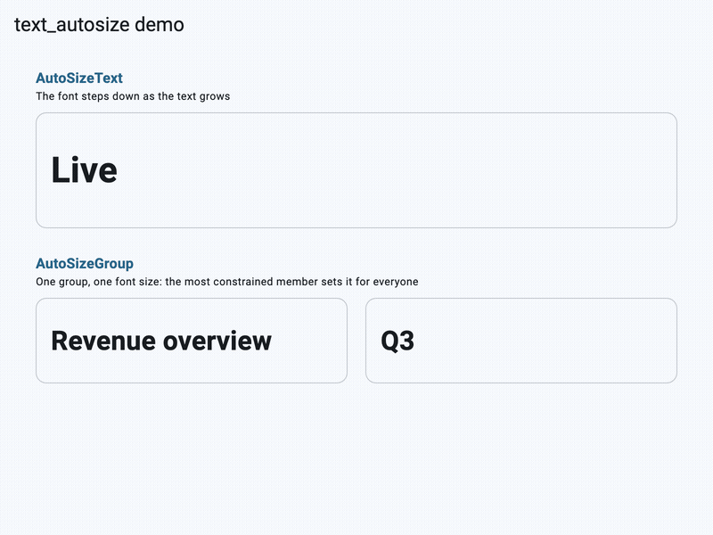

# text_autosize

A Flutter widget that automatically resizes text to fit within its bounds.

The API follows the `auto_size_text` package by Simon Leier, so existing code
migrates by changing the import. On top of the familiar API, this package is
built against current Flutter releases and handles `TextScaler` correctly,
including nonlinear system font scaling.

## Demo



## Features

* Shrinks text until it fits the available width, height and `maxLines`.
* `minFontSize`, `maxFontSize` and `stepGranularity` control the search range.
* `presetFontSizes` restricts the text to a fixed list of sizes.
* `AutoSizeGroup` keeps several texts at the same size.
* `AutoSizeText.rich` resizes a whole `TextSpan` tree proportionally.
* `overflowReplacement` swaps in another widget when nothing fits.
* `textScaler` aware: the fitted size accounts for the user's font scale.
* Works inside `SelectionArea`, since it builds a regular `Text` widget.

## Usage

Requires Flutter 3.32 or later.

```dart
import 'package:text_autosize/text_autosize.dart';

AutoSizeText(
  'The text to display',
  style: TextStyle(fontSize: 20),
  maxLines: 2,
)
```

The widget behaves like `Text`, except that it lowers the font size until the
text fits the incoming constraints. It needs bounded constraints to resize
against, for example from a `SizedBox` or an `Expanded`.

### maxLines and minFontSize

```dart
AutoSizeText(
  'A single line that shrinks down to 10 before it ellipsizes',
  style: TextStyle(fontSize: 30),
  maxLines: 1,
  minFontSize: 10,
  overflow: TextOverflow.ellipsis,
)
```

### Preset font sizes

If only some sizes are allowed, pass them in descending order. The first size
that fits is used:

```dart
AutoSizeText(
  'One of three sizes',
  presetFontSizes: [40, 20, 14],
  maxLines: 1,
)
```

### Synchronizing several texts

Give all texts the same `AutoSizeGroup`. Every member renders at the size of
the most constrained one:

```dart
final group = AutoSizeGroup();

AutoSizeText('Label one', group: group, maxLines: 1);
AutoSizeText('A much longer label two', group: group, maxLines: 1);
```

A group settles one frame after its members first appear, and does not
oscillate: each member measures itself against its own constraints alone, so
reporting a size can only pull the group's minimum down. The one frame is
visible in the case where members build before a more constrained sibling has
reported — they lay out at their own size, then rebuild at the group's. If you
are asserting on a size in a test, or capturing a golden on the frame the
widget appears, pump once more first. Removing the member that was setting the
minimum lets the rest grow back.

### Rich text

```dart
AutoSizeText.rich(
  TextSpan(
    text: 'Mixed ',
    children: [
      TextSpan(text: 'sizes', style: TextStyle(fontSize: 40)),
    ],
  ),
  style: TextStyle(fontSize: 20),
  maxLines: 1,
)
```

All font sizes in the span tree are scaled by the same factor, so the
proportions of the spans are preserved.

### Overflow replacement

```dart
AutoSizeText(
  'A text that might not fit at minFontSize',
  minFontSize: 16,
  overflowReplacement: Text('Not enough room'),
)
```

## Migration from auto_size_text

1. Replace the dependency:

   ```sh
   flutter pub remove auto_size_text
   flutter pub add text_autosize
   ```

2. Replace the import. The class names `AutoSizeText` and `AutoSizeGroup` are
   unchanged:

   ```dart
   import 'package:text_autosize/text_autosize.dart';
   ```

3. Optionally move `textScaleFactor` to `textScaler`. This step is no longer
   required to compile: `textScaleFactor` still works and is treated as
   `TextScaler.linear(factor)`. It is deprecated and will be removed in a
   future release, so prefer `textScaler`:

   ```dart
   // still compiles, deprecated
   AutoSizeText('Hello', textScaleFactor: 1.5)
   // preferred
   AutoSizeText('Hello', textScaler: TextScaler.linear(1.5))
   ```

   Setting both `textScaler` and `textScaleFactor` on the same widget is not
   allowed and asserts in debug builds.

Intentional behavior differences from `auto_size_text` 3.0.0:

* The built `Text` carries the logical font size plus a `TextScaler`, instead
  of a pre-scaled font size with scaling disabled. The rendered pixels are
  identical; only the internal representation differs. Migrated tests that
  look up the inner `Text` through `textKey` and assert on `style.fontSize`
  see the logical value now.
* With a linear scaler, `minFontSize`, `maxFontSize` and `presetFontSizes`
  produce the same rendered size as the original package. The behavior only
  differs under a nonlinear scaler (for example Android 14 system font
  scaling), where the fitted size is computed with the actual scaler instead
  of a single factor.
* Rich text is measured with the fully resolved style, exactly as `Text.rich`
  renders it. The original measured the span's own style only, which could
  mismeasure spans that inherit their size from `DefaultTextStyle`.
* Measurement resolves `textAlign` and `textDirection` the same way the
  rendered `Text` does, instead of assuming left-aligned, left-to-right text.
* An `AutoSizeGroup` synchronizes the logical font size of its members. Each
  member still applies its own `TextScaler` when rendering.
* `presetFontSizes` must be in descending order; this is now checked with an
  assert instead of being silently required.
* `textWidthBasis`, `textHeightBehavior` and `selectionColor` are passed
  through to the built `Text`.

## How it works

The widget measures the text with a `TextPainter` against the incoming
constraints. If the preferred font size does not fit, a binary search runs
over the candidate sizes between `minFontSize` and the preferred size in
steps of `stepGranularity`, or over `presetFontSizes` if given. A build
therefore performs O(log n) text layouts for n candidate sizes, and a single
`TextPainter` instance is reused for all measurements.

## Limitations

* The widget only shrinks text below its preferred size. It does not grow
  text to fill extra space, except through `presetFontSizes`.
* Resizing needs a bounded constraint. In an unbounded context, such as the
  scroll direction of a `ListView` or inside an `UnconstrainedBox`, the text
  keeps its preferred size. This is safe but performs no resizing on that
  axis.
* The widget is built around a `LayoutBuilder`, so it cannot be used where
  intrinsic dimensions are required, for example inside `IntrinsicWidth` or
  `IntrinsicHeight`.
* `strutStyle` is passed through as given and is not resized with the text. A
  strut with a fixed font size puts a floor under the line height.
* `softWrap: false` affects rendering but not measurement, so text that is
  fitted with wrapping in mind can still overflow horizontally when soft
  wrapping is disabled. This matches `auto_size_text`.
* With `wrapWords: false`, the longest-word check measures the words with the
  base style only. Per-span font sizes of rich text are not considered in
  that check. This also matches `auto_size_text`.

## Credits

The API follows the [auto_size_text](https://pub.dev/packages/auto_size_text)
package by Simon Leier.

## License

MIT. See [LICENSE](LICENSE).
